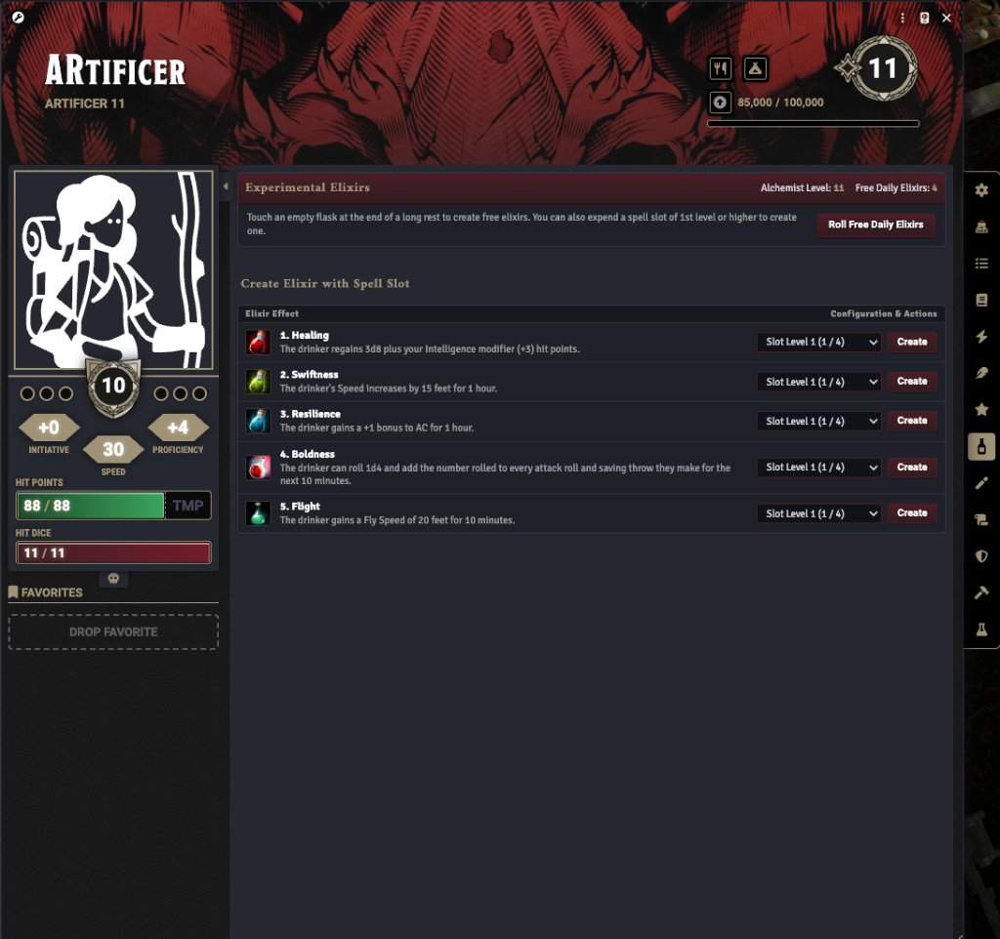

# Artificer Foundry - Experimental Elixir Generator

This module provides character sheet integration for Alchemist Artificers in Foundry VTT (D&D 5e). It automates the creation, scaling, rolling, and consumption of Experimental Elixirs.

## Screenshot



## Features

* **Dedicated Sheet Tab**: Adds an "Experimental Elixirs" tab to characters identified as Alchemist Artificers.
* **Automatic Scaling**: Dynamically scales daily free elixirs and elixir descriptions based on your Artificer level.
* **Free Daily Rolls**: Handles random d6 table rolling, choice outcomes (rolling a 6), and item additions automatically.
* **Spell Slot Crafting**: Expend available spell slots of 1st level or higher to create specific elixirs directly from the sheet.
* **Active Effect Automation**: Consuming (drinking) an elixir automatically applies its respective Active Effect (e.g., Speed increase, AC bonus, 1d4 bonus to attacks and saves) to the character.


## Installation

To install the module, copy the manifest link below and paste it into the Manifest URL field in the Foundry VTT Setup menu under Add-On Modules:

```
https://raw.githubusercontent.com/ddebasilio/artificer_elixir/refs/heads/main/module.json
```

## Compatibility

* **Foundry VTT**: Verified on version 12 up to version 14.
* **System**: D&D 5e.
